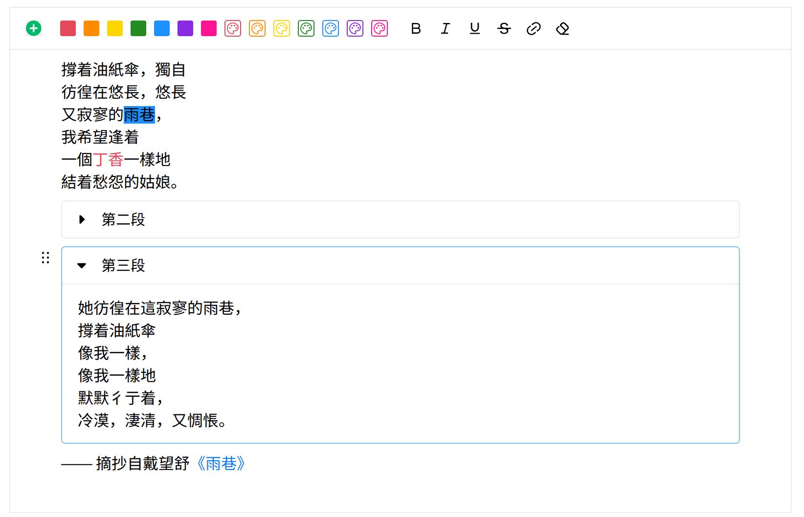

# Introduction

A fast and mordern block editor inspired by [yuque](https://www.yuque.com/) which supports two modes:
+ **edit mode**, support edit content with lots of tools
+ **read mode**, only for read rich contents.

More functions will come soon.

In edit mode:

In read mode:

# Get Started

please refer to see `examples/react-test`.

# Dev Environment

os: manjaro or mint 22.1

arch: x64

node: v22.20.0

ts: 5.9.3

